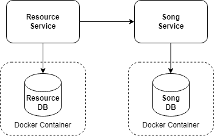
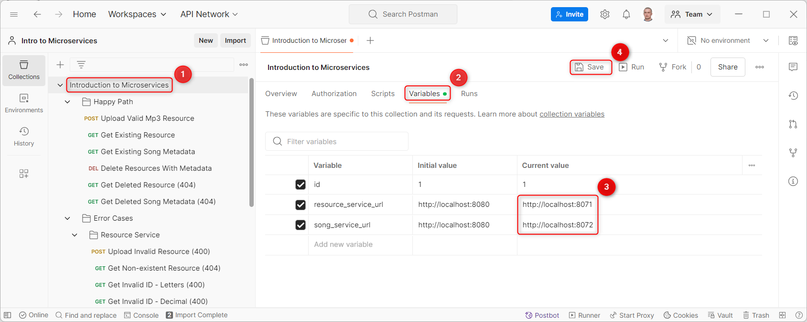
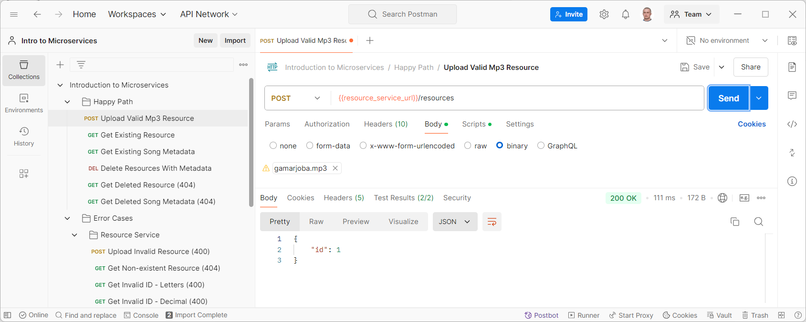
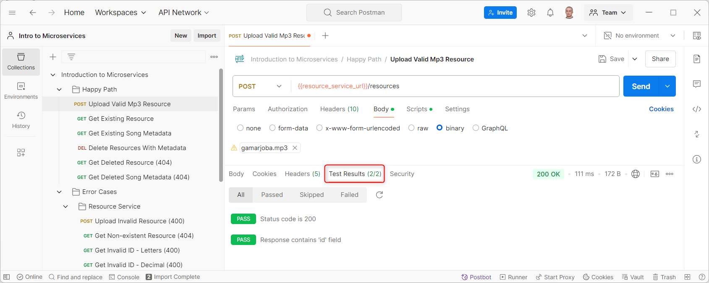
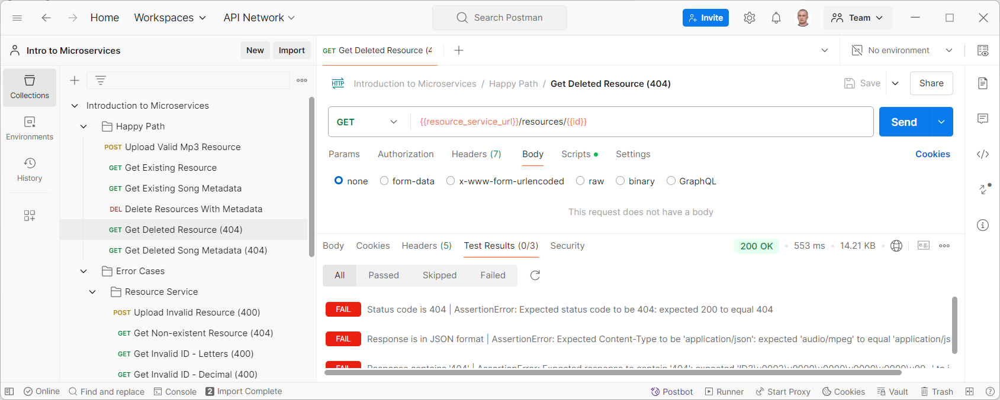
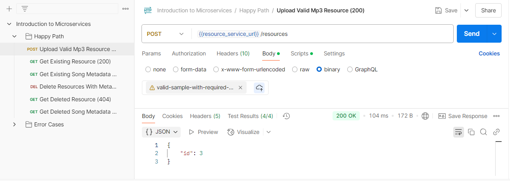

# Table of contents

- [What to do](#what-to-do)
- [Sub-task 1: Resource Service](#sub-task-1-resource-service)
- [Sub-task 2: Song Service](#sub-task-2-song-service)
- [Notes](#notes)
- [Checklist: Before you submit the task](#checklist-before-you-submit-the-task)

## What to do

Your task is to implement a microservices system consisting of two services:

- **Resource Service** - for MP3 file processing
- **Song Service** - for song metadata management

### Service relationships

The services are designed to work together as follows:

- **Resource Service** handles the storage and processing of MP3 files.
- **Song Service** manages metadata for each song, ensuring that each metadata entry corresponds to a unique MP3 file in the Resource Service.
- The song metadata and resource entities maintain a one-to-one relationship:
    - Each song metadata entry is uniquely associated with a resource, linked via the resource ID.
    - Deleting a resource triggers a cascading deletion of its associated metadata.

### Requirements

- **Framework**: Spring Boot 3.4.0 or higher
- **Java Version**: Java 17 or later (LTS versions)
- **Programming Language**: Java
    - Usage of Kotlin, Groovy, Scala, or any other JVM-based language is not allowed
- **Build Tool**: Maven or Gradle
- **Database**: PostgreSQL
- **Application Startup**: In this module, Resource Service and Song Service must run locally (not in Docker)

> This course does not require creating unit tests. If you are not planning to include tests, please delete `src/test/` directory and remove the test dependencies (`spring-boot-starter-test` etc.) from your `pom.xml` or `build.gradle` files.

## Sub-task 1: Resource Service

The Resource Service implements CRUD operations for processing MP3 files. When uploading an MP3 file, the service:

- Stores the MP3 file in the database.
- Extracts the MP3 file tags (metadata) using external libraries like [Apache Tika](https://www.tutorialspoint.com/tika/tika_extracting_mp3_files.htm).
- Invokes the Song Service to save the MP3 file tags (metadata).
- Must not modify the tags (metadata) extracted from the MP3 file before sending them to the Song Service, except for converting the duration from seconds to mm:ss format.

### API endpoints

---

#### 1. Upload resource

```
POST /resources
```

**Description:** Uploads a new MP3 resource.

**Request:**

- **Content-Type:** audio/mpeg
- **Body:** Binary MP3 audio data

**Response:**

```json
{
    "id": 1
}
```

- **Description:** Returns the ID of successfully created resource.

**Status codes:**

- **200 OK** – Resource uploaded successfully.
- **400 Bad Request** – The request body is invalid MP3.
- **500 Internal Server Error** – An error occurred on the server.

---

#### 2. Get resource

```
GET /resources/{id}
```

**Description:** Retrieves the binary audio data of a resource.

**Parameters:**

- `id` (Integer): The ID of the resource to retrieve.
- **Restriction:** Must be a valid ID of an existing resource.

**Response:**

- **Body:** Returns the audio bytes (MP3 file) for the specified resource.

**Status codes:**

- **200 OK** – Resource retrieved successfully.
- **400 Bad Request** – The provided ID is invalid (e.g., contains letters, decimals, is negative, or zero).
- **404 Not Found** – Resource with the specified ID does not exist.
- **500 Internal Server Error** – An error occurred on the server.

---

#### 3. Delete resources

```
DELETE /resources?id=1,2
```

**Description:** Deletes specified resources by their IDs. If a resource does not exist, it is ignored without causing an error.

**Parameters:**

- `id` (String): Comma-separated list of resource IDs to remove.
- **Restriction:** CSV string length must be less than 200 characters.

**Response:**

```json
{
    "ids": [1, 2]
}
```

- **Description:** Returns an array of the IDs of successfully deleted resources.

**Status codes:**

- **200 OK** – Request successful, resources deleted as specified.
- **400 Bad Request** – CSV string format is invalid or exceeds length restrictions.
- **500 Internal Server Error** – An error occurred on the server.

---

## Sub-task 2: Song Service

The **Song Service** implements CRUD operations for managing song metadata records. The service uses the Resource ID to uniquely identify each metadata record, establishing a direct one-to-one relationship between resources and their metadata.

---

### API endpoints

#### 1. Create song metadata

```
POST /songs
```

**Description:** Create a new song metadata record in the database.

**Request body:**

```json
{
    "id": 1,
    "name": "We are the champions",
    "artist": "Queen",
    "album": "News of the world",
    "duration": "02:59",
    "year": "1977"
}
```

- **Description:** Song metadata fields.

**Validation rules:**

- **All fields are required.**
- `id`: Numeric, must match an existing Resource ID.
- `name`: 1-100 characters text.
- `artist`: 1-100 characters text.
- `album`: 1-100 characters text.
- `duration`: Format `mm:ss`, with leading zeros.
- `year`: `YYYY` format between 1900-2099.

**Response:**

```json
{
    "id": 1
}
```

- **Description:** Returns the ID of the successfully created metadata record (should match the Resource ID).

**Status codes:**

- **200 OK** – Metadata created successfully.
- **400 Bad Request** – Song metadata is missing or contains errors.
- **409 Conflict** – Metadata for this ID already exists.
- **500 Internal Server Error** – An error occurred on the server.

---

#### 2. Get song metadata

```
GET /songs/{id}
```

**Description:** Get song metadata by ID.

**Parameters:**

- `id` (Integer): ID of the metadata to retrieve.
- **Restriction:** Must match an existing Resource ID.

**Response:**

```json
{
    "id": 1,
    "name": "We are the champions",
    "artist": "Queen",
    "album": "News of the world",
    "duration": "02:59",
    "year": "1977"
}
```

**Status codes:**

- **200 OK** – Metadata retrieved successfully.
- **400 Bad Request** – The provided ID is invalid (e.g., contains letters, decimals, is negative, or zero).
- **404 Not Found** – Song metadata with the specified ID does not exist.
- **500 Internal Server Error** – An error occurred on the server.

---

#### 3. Delete songs metadata

```
DELETE /songs?id=1,2
```

**Description:** Deletes specified song metadata records by their IDs. If a metadata record does not exist, it is ignored without causing an error.

**Parameters:**

- `id` (String): Comma-separated list of metadata IDs to remove.
- **Restriction:** CSV string length must be less than 200 characters.

**Response:**

```json
{
    "ids": [1, 2]
}
```

- **Description:** Returns an array of the IDs of successfully deleted metadata records.

**Status codes:**

- **200 OK** – Request successful, metadata records deleted as specified.
- **400 Bad Request** – CSV string format is invalid or exceeds length restrictions.
- **500 Internal Server Error** – An error occurred on the server.

## Notes

### Controllers

- Keep controllers slim; they should only handle HTTP-related concerns.
- Do not place validation (e.g., ID length checks) in controllers. Move validation to the service layer or use request DTOs with validation annotations.
- Do not include business logic (e.g., data transformations, string parsing) in controllers. Move such logic to the service layer or mappers.
- Avoid using raw entities for requests and responses to prevent exposing sensitive fields or internal schema details. Use DTOs instead.
- Wrap responses in `ResponseEntity<T>` with appropriate HTTP status codes.
- Use specific response types (e.g., `ResponseEntity<Map<String, Long>>`, `ResponseEntity<SongDto>`) to ensure API consistency.
- Controllers should not manually throw or handle exceptions. Instead, throw exceptions in the service layer and handle them in a global exception handler.

### Error Handling

- Add a global exception handler using `@RestControllerAdvice`.
- Map exceptions to appropriate HTTP status codes.
- Provide meaningful error messages and error codes in responses using a unified structure (see the [API response specification](./api-tests/api-response-specification.md) for detailed response formats):

#### Simple error response

```json
{
    "errorMessage": "Resource with ID=1 not found",
    "errorCode": "404"
}
```

#### Validation error response

```json
{
    "errorMessage": "Validation error",
    "details": {
        "duration": "Duration must be in mm:ss format with leading zeros",
        "year": "Year must be between 1900 and 2099"
    },
    "errorCode": "400"
}
```

#### Incorrect responses and why they are wrong
Example 1:
```json
{
    "errorMessage": "400 BAD_REQUEST \"Validation failure\"",
    "errorCode": 400
}
```
Issues:
- `"400 BAD_REQUEST"` in `errorMessage` is redundant (status code already exists in `errorCode`).
- No details about which fields failed validation and why.

---

Example 2:
```json
{
    "errorMessage": "Validation failure",
    "errorCode": 400
}
```
Issue:
- No details about which fields failed validation and why.

---

Example 3:
```json
{
    "errorMessage": "problemDetail.org.springframework.web.bind.MethodArgumentNotValidException",
    "errorCode": 400,
    "details": {
        "name": "Name is required"
    }
}
```
Issues:
- The `errorMessage` should never contain raw exception names (e.g., `MethodArgumentNotValidException`). This exposes internal implementation details to the API consumer.
- The message should be replaced with a human-readable `"Validation failed"`.

---

Example 4
```json
{
    "errorMessage": "Method parameter 'id': Failed to convert value of type 'java.lang.String' to required type 'int'; For input string: \"ABC\"",
    "errorCode": "400"
}
```
Issues:
- The `errorMessage` is too technical and exposes unnecessary implementation details (`java.lang.String`, `int` conversion).
- It does not clearly indicate what the user did wrong.

---


### Database implementation requirements

- Use Docker containers for database deployment.
- [PostgreSQL](https://hub.docker.com/_/postgres) 16+ is required as the database engine, preferably Alpine-based.
- Each service should have its own dedicated database instance.
- A single Docker Compose file located in the root directory of the project must be used to start both database containers.
- For this module, you can use the [provided compose.yaml](./docker-compose-file/compose.yaml) file in your project.
- The use of migration tools such as Flyway or Liquibase is not allowed.
- Database schema initialization must be fully automated using Hibernate.
- In this module, Hibernate’s `ddl-auto=update` must be used for schema management to simplify development.
- In this module, SQL initialization scripts (e.g., `schema.sql`, `data.sql`) must not be used.




---

### Structure

Both microservices represent a unified application and (will) use shared files. Please merge them into a single folder (Git repository), using the following folder structure as an example:

For a Maven-based project:

```
maven-project/
├── resource-service/
│   ├── src/
│   └── pom.xml
├── song-service/
│   ├── src/
│   └── pom.xml
├── compose.yaml
└── .gitignore
```

---

For a Gradle-based project:

```
gradle-project/
├── gradle/
│   ├── wrapper/
│   │   ├── gradle-wrapper.jar
│   │   ├── gradle-wrapper.properties
├── resource-service/
│   ├── src/
│   └── build.gradle
├── song-service/
│   ├── src/
│   └── build.gradle
├── gradlew
├── gradlew.bat
├── settings.gradle
├── compose.yaml
└── .gitignore
```

> **Notes**:
> - The Gradle project must use the Gradle Wrapper (`gradlew`).
> - Keep `gradlew` only in the root directory.
> - Configure `settings.gradle` to include and link all services.
> - Do not ignore the Gradle Wrapper files; they must be included in the `git` repository.

---

### Postman collection and sample MP3 file for testing

Please use the [Postman collection](./api-tests/introduction_to_microservices.postman_collection.json) and a [sample MP3 file](./sample-mp3-file/mp3.zip) with the necessary tags for testing the Resource Service and Song Service APIs. This collection will help validate the correct functioning of all features and data validations. Ensure that the test results are compared against the [API response specification](./api-tests/api-response-specification.md) to verify compliance with the expected responses.

1. In the **Variables** tab of the collection, set the variables `resource_service_url` and `song_service_url` with your ports. Click **Save** to apply.



---

2.Send the requests. Ensure you receive the correct responses.



---

3. In the **Test Results** tab, verify that all tests for the requests have passed.



---

4. If any tests failed, make necessary adjustments to your code to ensure the API functions as expected, without changing anything in the Postman collection itself.



Ensure that your services handle **all** requests accurately and comply with the API specifications outlined in the documentation.

> **IMPORTANT!** 
> - Take screenshots confirming the successful completion of **all** API tests using provided [sample MP3 file](./sample-mp3-file/mp3.zip).
> - Compile screenshots into a **SINGLE PDF or DOCX file**, and place this file in the personal folder provided to you by Avalia.
> - Ensure the response body and test results are visible, as shown in the example below:
> 

---

### Adding a Git repository link to your personal folder

Consider placing a link to your Git repository in your personal folder for the practical task instead of uploading your files or an archive with files.

In the folder you access through the link provided by Avalia Kicker bot, add a link to your Git repository:
- Click on the "New" button.
- From the dropdown menu, select "Link".
- Paste the URL of the public Git repository with your solution.
- Save the link. The new link will now appear in the folder.


---

## Checklist: Before you submit the task

Before submitting your task, please ensure that you have completed all the required steps:

✅ **Controllers**
- [ ] Controllers handle only HTTP-related concerns.
- [ ] Validation logic is moved to the service layer or request DTOs with validation annotations.
- [ ] Business logic (e.g., data transformations, string parsing) is in the service layer or mappers, not in controllers.
- [ ] Raw entities are not used for requests or responses; DTOs are used instead.
- [ ] Responses are wrapped in `ResponseEntity<T>` with appropriate HTTP status codes.
- [ ] Specific response types are used (e.g., `ResponseEntity<Map<String, Long>>`, `ResponseEntity<SongDto>`) to maintain API consistency.
- [ ] Controllers do not manually throw or handle exceptions; exceptions are thrown in the service layer and handled globally.
- [ ] Endpoints strictly follow the specified paths without additional prefixes (e.g., `/api/v1/` is not added, etc.).

✅ **Error handling & validation**
- [ ] Implemented global exception handling with `@RestControllerAdvice`.
- [ ] Used the specified error response format for general and validation errors.
- [ ] Enforced all validation rules for song metadata (e.g., correct year format, duration format, required fields).

✅ **Database & Docker**
- [ ] Used PostgreSQL 16+ as the database.
- [ ] Ensured each service has its own dedicated database instance.
- [ ] Database schema initialization is fully automated.
- [ ] Used Hibernate’s `ddl-auto=update` for schema management in this module.
- [ ] Did not use migration tools such as Flyway or Liquibase.
- [ ] Did not use SQL initialization scripts (e.g., `schema.sql`, `data.sql`) in this module.
- [ ] Deployed databases in Docker containers using the [provided Docker Compose file](./docker-compose-file/compose.yaml) (`compose.yaml`).
- [ ] The Docker Compose file is located in the root directory and correctly starts both databases.
- [ ] No Dockerfiles are present, as services must run locally (not in Docker).

✅ **Project structure**
- [ ] Used the correct folder structure.
- [ ] Merged both services into a single Git repository.
- [ ] Created a public Git repository for your project.
- [ ] Excluded IDE-specific configuration files and folders (e.g., `.idea/`, `.vscode/`, `.settings/`, `*.iml`).
- [ ] Ready to place the link to your repository in the personal folder in Avalia.

✅ **API testing**
- [ ] Ran Postman tests using the provided [collection](./api-tests/introduction_to_microservices.postman_collection.json) and [sample MP3 file](./sample-mp3-file/mp3.zip).
- [ ] Verified that all API tests pass.
- [ ] Checked that all API responses conform to the [API response specification](./api-tests/api-response-specification.md).
- [ ] Took screenshots of test results and compiled them into a single PDF or DOCX file.
- [ ] Ready to place the test result PDF or DOCX file in the personal folder in Avalia.
